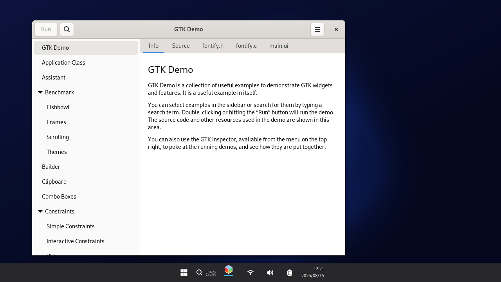
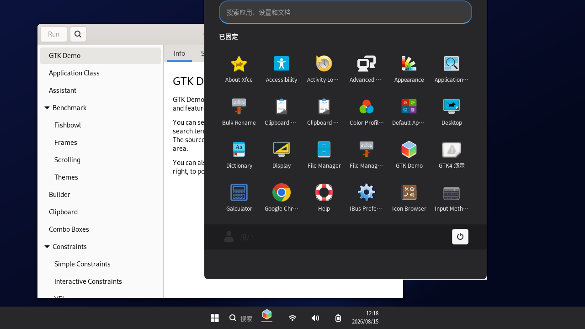

# ElevenDE 3.4

**Windows 11 风格的 Linux X11 桌面环境** —— 自研 C/Xlib 桌面 Shell + Openbox 窗口管理器 +
Qt6/GTK 应用套件，在视觉与交互上对齐 Windows 11，同时完整保留 Linux 生态兼容性。
面向 Debian 系所有发行版（Debian / Ubuntu / Kali / Mint / Pop!_OS …），
一键安装后即可作为日常桌面使用。


| | |
|---|---|
|  |  |
| *桌面 + 顶部任务栏* | *开始菜单（左对齐图标组）* |

> **状态：M3.5.1 图标与命名完善版本**。核心桌面、内置应用套件、快捷键管理、SAS 安全选项屏幕、WLAN 面板及 **Lindows 资源管理器**均可用。

---

## 3.5.1 图标、命名与任务栏完善（2026-08-18）

本轮集中处理用户可见的身份一致性问题：资源管理器在窗口标题中统一显示为 **Lindows 资源管理器**；所有自带 Qt 应用发布第一方窗口图标；任务栏优先使用 ElevenDE 图标主题并拒绝黑色占位图；不再把锁屏/SAS 内部窗口误显示为右下角锁托盘图标。

| 区域 | 优化与行为 |
|---|---|
| Lindows 资源管理器 | 主窗口标题、任务栏和窗口搜索统一使用“Lindows 资源管理器”，不再出现“Windows 资源管理器”命名。 |
| 应用窗口图标 | 计算器、记事本、设置、任务管理器、照片和资源管理器均显式设置 ElevenDE 第一方 SVG/PNG 图标；窗口管理器、Alt-Tab 与任务栏可获得完整 `_NET_WM_ICON`。 |
| 任务栏图标解析 | 对内置程序先查找受控的 ElevenDE 主题图标，再退回应用自身 `_NET_WM_ICON`；若后者超过 92% 为近黑色像素则丢弃，避免黑色空白占位块。 |
| 系统托盘 | 过滤锁屏与 SAS 内部窗口，右下角不再出现无操作意义的锁图标；网络、音量、输入法、时钟与显示桌面入口保持不变。 |
| 设置应用 | 侧栏从依赖彩色表情字体的符号切换为字体兼容的线性字形，避免缺字方块、彩色表情混入或空白图标。 |
| 回归验证 | 在 Xvfb + Openbox 中启动计算器、设置、任务管理器、记事本和 Lindows 资源管理器；检查窗口图标属性、任务栏截图和托盘窗口树。登录页、桌面热刷新与资源管理器命令栏回归同时通过。 |

### 构建与安装

```sh
chmod +x build-deb.sh
sudo ./build-deb.sh
sudo apt install ./elevende_3.5.1_amd64.deb
```

> **升级说明**：现有用户无需删除配置。安装 3.5.1 后重新登录 ElevenDE，即会使用新的图标主题、任务栏解析逻辑和资源管理器命名。

## 3.5.0 体验与资源管理器升级（2026-08-18）

本版聚焦日常桌面体验：资源管理器将既有文件操作、回收站、过滤、排序与三种视图模式整合进双层 Windows 风格命令栏；桌面图标、应用图标、壁纸热更新与登录密码输入也完成针对性优化。

| 区域 | 优化与行为 |
|---|---|
| 资源管理器 | 新增常驻命令栏，直接提供新建文件夹/文本文档、剪切、复制、粘贴、重命名、删除、查看模式、排序、刷新、复制路径和属性。保留地址栏、面包屑、搜索、回收站、隐藏文件、详细信息及多选操作。 |
| 资源管理器交互 | “新建”使用整按钮弹出菜单，保证不同 Openbox 主题下有充足鼠标命中区域；新增功能经过 Xvfb + Openbox 下的真实点击验证。 |
| 桌面图标 | 选中效果改为柔和的透明度淡入高光，而非突兀缩放弹跳；图标布局在外部创建、删除或重命名 `~/Desktop` 内容后自动重扫。 |
| 壁纸刷新 | 同时使用原子客户端消息和纳秒级修改时间/文件大小签名。设置程序或外部工具原子替换壁纸后，Shell 将在运行中刷新，不再需要重启。 |
| 应用图标 | 为计算器、资源管理器、记事本、任务管理器、终端和运行提供统一的 Windows 灵感渐变图标；设置、照片、锁屏入口采用 MIT 许可的 Fluent System Icons 并在主题目录保留第三方许可说明。 |
| 登录页 | 密码框具备 I-beam 悬停光标、蓝色焦点边框、悬停背景与低频双缓冲闪烁文本光标。背景仍通过离屏帧一次拷贝，避免整页可见闪烁。 |
| 自动化验证 | 覆盖资源管理器“新建”鼠标操作、桌面图标/原子壁纸热刷新、密码框真实点击与光标闪烁、应用客户区、显示桌面、WLAN 入口、SAS 与登录页稳定性。 |

### 构建与安装

```sh
chmod +x build-deb.sh
./build-deb.sh
sudo apt install ./elevende_3.5.1_amd64.deb
```

安装后重新登录 ElevenDE。壁纸、桌面图标与图标主题会自动生效；无需清除用户配置。

## 3.4.2 输入路由修复（2026-08-18）

本版针对“应用和标题栏有悬停动画、但点击不生效”的实际故障重做鼠标事件边界。排查确认桌面 Shell 不存在覆盖在应用之上的可见/透明全屏窗口；问题来自旧版本在窗口映射与销毁路径仍会向 X11 注入鼠标释放和窗口移动取消事件，且已有用户目录可能保留旧 Openbox 鼠标配置。

| 区域 | 修复与行为 |
|---|---|
| Shell 输入边界 | 完全停用 Shell 的指针抓取、合成按钮释放和窗口 Map/Destroy 阶段的移动取消。Shell 仅处理自身任务栏与桌面窗口；Openbox 和应用独占客户区、标题栏和窗口控制事件。 |
| 标题栏控制 | `rc.xml` 与 `rc.template.xml` 改为 Openbox 标准的 `Press`（聚焦/前置）+ `Click`（最小化/最大化/关闭）双阶段绑定，恢复拖动、最小化、最大化和关闭。 |
| 旧用户配置迁移 | 会话启动会检测 `ELEVENDE-RC-REV: 3.4.2-input-routing` 标记；缺失时自动从新模板重建 `~/.config/elevende/rc.xml`，防止旧版配置继续覆盖修复。 |
| 登录页光标 | 登录覆盖窗口显式使用 X11 `XC_left_ptr` 光标；指针抓取严格限定到登录窗口自身，而非根窗口。 |
| 验证 | 在 Xvfb + Openbox + ElevenDE 主题下确认客户区点击落入 Openbox 客户框架而非 Shell 覆盖层；Qt 记事本点击输入并读取剪贴板通过，登录页指针目标为登录窗口自身。 |

### 安装/升级

使用新 DEB 安装后重新登录 ElevenDE 即可自动迁移旧的用户级 Openbox 配置。无需手动删除配置；若希望立即强制刷新，可执行：

```sh
rm -f ~/.config/elevende/rc.xml
```

随后注销并重新进入 ElevenDE 会话。

## 3.4.1 维护更新（2026-08-18）

本次维护集中修复 **输入事件被 Shell 后台干预、任务栏操作缺失、SAS 与任务栏争夺层级** 以及登录页全屏刷新问题。所有修改保持 X11/Openbox 架构，不引入桌面环境外部服务依赖。

| 区域 | 修复与行为 |
|---|---|
| 全局交互 | 移除了 Shell 在后台重复注入鼠标释放、重复发送移动取消消息的循环。Openbox 现在独占真实的标题栏拖动、最小化、最大化与关闭事件，应用客户区点击不再被 Shell 中断。 |
| WLAN | 任务栏网络图标拥有独立命中区域。点击后通过 `sas-screen --network` 调用现有 WLAN 面板；面板会自动使用 NetworkManager 或 iwd 扫描、选择网络、请求密码、连接或断开。 |
| 显示桌面 | 右侧细条改为向窗口管理器发送标准 `_NET_SHOWING_DESKTOP` 客户端消息，可在显示桌面与还原窗口之间切换。 |
| 输入法 | 右下角时钟左侧常驻显示 `中`/`ENG`。点击时优先切换 fcitx5/fcitx；没有输入法守护进程时循环切换 XKB 键盘布局。 |
| 通知 | 移除通知守护进程创建的托盘状态按钮；保留 D-Bus `org.freedesktop.Notifications` 通知接口及右上角通知弹窗。 |
| SAS 层级 | Shell 不再每帧抬升任务栏。SAS 使用一次性顶层窗口标记和显示时抬升，因此可以稳定覆盖任务栏而不会发生交替闪烁。 |
| 登录页 | 登录界面改为离屏帧绘制后一次拷贝到窗口，并删除每秒整页重绘与 Expose 后重抬；密码、错误提示和真实 Expose 仍会即时刷新。 |

### 构建与安装

`build-deb.sh` 会安装所需构建依赖、编译完整组件，并输出可安装的 Debian 包。WLAN 面板的运行时后端由 `network-manager` 或 `iwd` 提供；Debian 包声明前者为依赖，使用 iwd 的系统可自行替换。

```sh
chmod +x build-deb.sh
./build-deb.sh
sudo apt install ./elevende_3.5.1_amd64.deb
```

源码安装仍可使用：

```sh
sudo ./install.sh
```

> **验证建议**：在 X11 会话中依次确认资源管理器、设置、运行、计算器的客户区和标题栏操作；点击任务栏的网络图标检查 WLAN 面板；点击输入法标识和显示桌面细条；最后使用 `Ctrl+Alt+Del` 确认 SAS 全程覆盖任务栏且无闪烁。

## 3.3 版本更新

**窗口管理（参考 KDE/Win11 重写焦点与图层模型）**
- 新窗口打开即获得焦点；**点击任意窗口（含客户区）即前置**（Frame/Titlebar
  绑定 Focus+Raise），修复"无法调整窗口图层、新窗口永远盖住旧窗口"
- 幽灵移动（开关窗口后其它窗口跟随鼠标）**体系化重写**，不再打补丁：
  - 10Hz 自主监测：按窗口 ID 追踪几何，连续滑动且物理无按键即判定幽灵并终止
    （旧版按任务槽位索引，窗口增删时检测恰好失效——这是反复出现的根因）
  - 幻影按键清除：服务器按键状态与 XI2 物理状态不一致时 100ms 内合成释放
  - 窗口 Map/Destroy 时刻主动清除幻影（幽灵最容易"咬住"新窗口的瞬间）
  - 安装脚本强制校验 libxtst（此前 Kali 上静默安装失败导致整套防御被禁用）

**任务栏（Win11 系统托盘区）**
- 右下角完整托盘：网络图标（WiFi/有线/离线三态）+ 音量图标（随音量变化、
  静音态）+ 电池（有电池才显示，充电态）+ 时间/日期双行 + 显示桌面细条
- 点击托盘 pill 弹出**音量面板**（滑块拖动/滚轮调节、点喇叭静音），
  滚轮悬停 pill 直接调音量；全部与任务栏居中集群对齐
- 任务栏应用图标修复：无 alpha 图标不再显示白块，退化 _NET_WM_ICON
  （空白占位图）自动回退主题图标/矢量图形

**登录/锁屏（Win11 logon 风格）**
- 壁纸压暗背景 + 头像圆（用户名首字符）+ 用户名 + Win11 密码框（占位文字、
  右侧箭头提交按钮，支持点击提交）+ 底部按键提示；修复 XImage 字节序偏色
- 锁屏/安全屏幕标记 NOTIFICATION 类型 + ABOVE 状态，**覆盖任务栏等 DOCK 面板**

**SAS 安全选项屏幕**
- 使用窗口类型标记与一次性显示时置顶，确保覆盖一切（含任务栏）而不与任务栏循环争夺层级
- 电源菜单样式与 SAS 对齐（深蓝卡片、白边、圆角、悬停高亮、图标项）

**开始菜单**
- 固定项持久化修复：pins2 保存路径此前被误建成**目录**，固定项从未写入成功
  （"重启恢复默认"的根因）；现在固定/取消固定立即持久化
- 应用列表右键菜单不再闪烁（修复菜单每帧重抬把右键菜单压下去的问题）
- 菜单打开时持有指针抓取：菜单外点击只关闭菜单，不再"穿透"打开后面的应用
- 磁贴/终端/浏览器/编辑器图标更换为自绘 Win11 Fluent 风格

**桌面**
- 桌面图标**真透明渲染**（逐像素 alpha 混合到壁纸），彻底去除白色底框
- 右键图片文件新增「设为桌面背景」；右键空白「个性化(壁纸)」直达设置对应页
- 壁纸热更新：文件变更后 ≤2 秒自动生效（mtime 监测 + 客户端消息双通道）

**其他**
- RunBox：移除 GTK CSD 头栏（此前与 WM 标题栏叠成两层、按钮样式错乱），
  焦点获取加固（打开即可输入）；标题栏按钮加大并换 Win11 风格字形
- Openbox 主题：标题栏加高、按钮 34×30、10×10 细线条字形
- 资源管理器：新增崩溃日志（/tmp/explorer-crash.log）+ 模型刷新期防护
- 移除 picom 无效选项 refresh-rate（开机 picom 警告消除）
- 设置支持 `--page <页面名>` 深链（供桌面菜单等组件直达对应页）

## 3.2 版本更新

- 👻 **窗口跟随鼠标问题重构修复**：整套幽灵移动防御重写为 10Hz 自主监测，
  不再依赖触发窗口：
  - **幻影清除**——服务器认为按键按着而物理上没按时（掉 release 的典型后果），
    立即合成释放并发送 MOVERESIZE_CANCEL，100ms 内根除；
  - **滑动检测**——按窗口 ID 追踪几何（旧版按任务槽位索引，窗口增删时槽位
    重排导致检测正好在开关窗口瞬间失效），连续 2 帧滑动即判定幽灵并终止；
    一次性位移（开窗定位、Win+方向吸附、最大化）只产生 1 帧，永不误杀；
  - XI2 原始事件改从 master 设备采集（slave 设备事件可能不成对导致误判）。
- 🖱️ **开始菜单右键穿透修复**：开始菜单/搜索打开时持有指针抓取，
  菜单外的点击一律"关闭菜单"而不再落到后面的窗口上；
  菜单空白处右键关闭菜单（Win11 行为）；菜单打开期间被抬升的窗口不再盖住菜单。
- 🔘 **固定项修复**："设置"磁贴此前是占位命令（xterm echo），
  现在直接打开 elevende-settings；"编辑器"改为自研记事本；
  旧安装持久化的失效磁贴自动迁移。
- ⚡ **电源菜单重做**（参考 SAS 安全选项的样式）：圆形电源按钮 +
  深色圆角卡片，睡眠/关机/重启/注销四项各带矢量图标；新增睡眠项。
- 🎨 **桌面图标全面优化**：
  - 图标 48→64px，全套自绘 Win11 Fluent 风格（此电脑/文件夹/压缩包/
    图片/视频/音频/PDF/Office 等，按扩展名自动匹配）；
  - 悬停/选中改为**真正的半透明高亮**（对壁纸逐像素混合，透出壁纸），
    选中为半透明洗色 + 圆角细边框，告别实心色块；
  - 长文件名自动省略号截断，不再撑破网格；悬停高亮跟随鼠标。

## 3.1 版本更新

- 🚀 **开机直达 ElevenDE**：安装脚本自动禁用 GDM/LightDM/SDDM，
  tty1 自动登录 → startx 直接进入桌面（`KEEP_DISPLAY_MANAGER=yes` 可跳过）
- ⌨️ **Win 快捷键全面修复**：Super 键改用 XkbStateNotify 监听（不再 XGrabKey），
  彻底消除「按 Win+E 却打开开始菜单搜索」的冲突——单按 Win 开菜单（松开时触发），
  Win+E/D/R/L/I、Win+方向、Alt+F4/Tab、Ctrl+Shift+Esc 全部正常
- 🪟 **右键菜单修复**：移除 Openbox Frame 上下文的右键绑定
  （它抢走了应用窗口内的右键），资源管理器文件/空白右键菜单全部恢复
- 👻 **关窗后窗口跟随鼠标修复**：窗口销毁时主动取消移动/Resize + 清除幽灵按键；
  滑动检测器增强（指针在任务栏/桌面上时即使有幻影按键也强制恢复）
- 🗂️ **任务管理器重做**：仿 Windows 11 布局——左侧图标栏（进程/性能/详细信息）、
  性能页 CPU/内存实时曲线图、状态栏汇总（参考 SysMonTask）
- 🖼️ **全新 Win11 风格图标**：此电脑/主目录/文件夹/回收站/压缩包/图片/视频/
  音频/PDF/Office 三件套等 16 个自绘 Fluent 图标（SVG 源 + 4 档 PNG）
- 📎 **文件关联修复**：桌面图标按目录/文件分流（文件走 xdg-open 不再误开
  资源管理器）；内置 mimeapps.list 默认关联表；新增自研图片查看器 elevende-photos
- ⚙️ **设置扩展为 11 页**：新增 声音（音量/输出设备）、时间和语言（时区/NTP）、
  默认应用（按 MIME 选择默认程序）、鼠标（指针速度）、电源（睡眠/重启/关机/电池）、
  用户（改密码/自动登录状态）
- 🐛 其他修复：Explorer 状态栏异步刷新与"0 项"、Ctrl+H 快捷键槽、
  磁盘空间格式化串、openbox 动作兼容（原版 3.6.1 无 HalfLeft/CancelMove，
  半屏吸附改由 keybind 引擎按实际分辨率生成 MoveResizeTo）

## 3.0 版本新增

- 🧩 **内置应用套件**（Qt6，统一 Win11 Fluent 风格，共享样式库 `apps/common/win11style.h`）：
  - **记事本** `elevende-notepad`：菜单栏/查找(Ctrl+F,F3)/缩放/自动换行/状态栏(行列·编码)/UTF-8+ANSI 自动识别
  - **设置** `elevende-settings`：系统(关于)/个性化(壁纸·深色浅色·强调色)/显示(分辨率·亮度)/网络/快捷键 五页
  - **任务管理器** `elevende-taskmgr`：/proc 直读，进程列表(CPU%·内存·用户)、结束/强制结束、2 秒刷新
  - **计算器** `elevende-calc`：Win11 标准计算器布局，全键盘支持
- ⌨️ **快捷键管理**：
  - `wm/shortcuts.json` 内置 19 个 Windows 习惯快捷键（Win+E/D/R/L/I、Alt+F4/Tab、Ctrl+Shift+Esc、PrintScreen、音量键…）
  - `elevende-keybind` 引擎：合并系统默认 + 用户覆盖 → 从 `rc.template.xml` 生成 Openbox 配置 → `openbox --reconfigure` 热重载
  - 设置 → 快捷键：双击改键、启用/禁用、恢复默认，点「应用」立即生效
- 🔐 **整合 SAS for Linux**（`SAS-for-Linux/`，Ctrl+Alt+Delete 安全选项屏幕）：
  会话常驻监听，锁定/注销/更改密码/任务管理器按钮全部对接 ElevenDE 自研组件，
  内置 Wi-Fi 面板；安装脚本自动 `mask ctrl-alt-del.target` 防止误重启
- 🏃 **整合 RunBox**（`runbox-linux/`，Win+R 运行对话框）：
  GTK3 实现，历史记忆，Windows 命令别名（notepad/calc/control/explorer/taskmgr/cmd）
  已改为优先启动 ElevenDE 自带应用
- 📸 **截图工具** `elevende-screenshot`：PrintScreen 全屏截图存 `~/Pictures/Screenshots/` 并发通知
- 🖼️ **三张 Win11 风格壁纸**（纯 Python 生成，`assets/wallpapers/`），
  设置页一键切换、**热更新**（Shell 新增 `_ELEVENDE_RELOAD_WALLPAPER` 协议）

## 特性（承自 2.0）

- 🖥️ **自研 C/Xlib 桌面 Shell**（`shell/main.c`，仅依赖 Xlib + Xft + gdk-pixbuf/libpng）：
  壁纸与桌面图标、任务栏、开始菜单、搜索、托盘、日历、电源菜单、通知——单一原生二进制
- 🔐 **登录门 + 锁屏**：`elevende-lock`（setuid-root 读 /etc/shadow），Win+L 随时锁定
- 🗂️ **内置文件管理器**：Explorer for Linux（Qt6，Win11 风格资源管理器，三视图/多选/回收站/重命名）
- 🏠 **Openbox + picom**：Win11 深色主题、圆角半透明、点击聚焦、Snap 半屏
- 💾 **一键安装**：Debian/Fedora/Arch 家族自动识别依赖

## 架构

```
┌──────────────────────────────────────────────────────────────┐
│  elevende-shell (C/Xlib)                                     │
│    壁纸+桌面图标 / 任务栏 / 开始菜单 / 搜索 / 托盘 / 日历 / 电源 │
│    新增: _ELEVENDE_RELOAD_WALLPAPER 壁纸热更新协议             │
├──────────────────────────────────────────────────────────────┤
│  elevende-notifyd (DBus org.freedesktop.Notifications)       │
│  elevende-lock (登录门/锁屏)   elevende-screenshot (PrintScr) │
│  elevende-keybind (快捷键引擎: shortcuts.json → rc.xml)       │
│  sas-screen (Ctrl+Alt+Del SAS 常驻)   runbox (Win+R)         │
├──────────────────────────────────────────────────────────────┤
│  Openbox（rc.xml 由 keybind 引擎生成） + picom（圆角/阴影）    │
├──────────────────────────────────────────────────────────────┤
│  Qt 应用套件: explorer.exe / elevende-settings /             │
│  elevende-notepad / elevende-taskmgr / elevende-calc         │
└──────────────────────────────────────────────────────────────┘
```

## 快捷键（设置 → 快捷键 可改）

| 按键 | 行为 | | 按键 | 行为 |
|---|---|---|---|---|
| `Super`（单按） | 开始菜单 | | `Win+I` | 设置 |
| `Win+E` | 文件资源管理器 | | `Win+Shift+N` | 记事本 |
| `Win+R` | 运行对话框 (RunBox) | | `Ctrl+Shift+Esc` | 任务管理器 |
| `Win+D` | 显示桌面 | | `PrintScreen` | 截图 |
| `Win+L` | 锁屏 | | `Ctrl+Alt+Del` | SAS 安全选项屏幕 |
| `Win+↑/↓` | 最大化/最小化 | | `Alt+F4` | 关闭窗口 |
| `Win+←/→` | 左/右半屏吸附 | | `Alt+Tab` / `Alt+Shift+Tab` | 切换窗口 |
| 音量键 | amixer 调节 | | `Esc` | 取消 move/resize |

## 安装

方式一：源码安装

```sh
sudo ./install.sh
```

方式二：deb 包安装（Debian/Ubuntu/Kali 系）

```sh
./build-deb.sh            # 编译并生成 elevende_3.5.1_amd64.deb（需联网装编译依赖）
sudo apt install ./elevende_3.5.1_amd64.deb
sudo elevende-setup-autologin    # 可选：配置 tty1 自动登录直达桌面
```

自动识别发行版家族（apt / dnf / pacman），完成：

1. 装依赖（xorg、openbox、picom、Qt6、GTK3、X11 开发库、字体、alsa-utils、x11-xserver-utils）
2. 构建全部组件：C Shell、keybind 引擎、截图工具、Explorer、SAS、RunBox、Qt 应用套件
3. 安装 Openbox 主题/模板/快捷键默认值/SAS 配置、`.desktop` 菜单项、壁纸
4. `mask ctrl-alt-del.target`（Ctrl+Alt+Del 交给 SAS，不再触发重启）
5. tty1 自动登录 → `startx elevende-session`；默认启动目标 multi-user

## 运行

```sh
sudo ./install.sh && sudo reboot
# 或手动：startx /usr/local/bin/elevende-session
```

## 目录结构

```
elevende/
├── shell/                 # C/Xlib 核心：main.c(shell) lock.c notifyd.c Makefile
├── wm/                    # Openbox: rc.xml rc.template.xml shortcuts.json
│                          #   sas-config.json menu.xml picom.conf ElevenDE主题
├── session/               # elevende-session 会话脚本
├── apps/
│   ├── common/win11style.h        # 共享 Win11 样式库
│   ├── notepad/ settings/ taskmgr/ calculator/ photos/  # Qt6 应用
│   └── screenshot/screenshot.c    # PrintScreen 截图
├── tools/keybind/keybind.c        # 快捷键引擎（JSON→Openbox XML）
├── Explorer-for-Linux/    # 子项目：Qt6 文件管理器（仅构建 explorer 目标）
├── SAS-for-Linux/         # 子项目：Ctrl+Alt+Del 安全选项屏幕（Qt6）
├── runbox-linux/          # 子项目：Win+R 运行对话框（GTK3）
├── assets/                # .desktop 入口、Xresources、壁纸、Win11 图标、mimeapps.list
├── docs/                  # 截图
├── install.sh
├── LICENSE                # MIT（子项目许可见各自目录）
└── README.md
```

## 路线图

- **M0–M2 ✅** X11 会话、C Shell、开始菜单、登录门/锁屏、通知、文件管理器、幽灵拖拽恢复
- **M3 ✅** 应用套件（记事本/设置/任务管理器/计算器）、快捷键管理、SAS/RunBox 整合、壁纸热更新、截图
- **M4 ⏳** deb 打包、StatusNotifier 真实托盘、窗口动画、Wine/Proton 集成、可访问性

## 已知限制

- 托盘 pill 为简化实现（未接 StatusNotifier）
- 设置「个性化 → 强调色」仅作用于 Qt 自带应用（C Shell 任务栏配色暂未接入）
- Wayland 不在支持范围（本桌面基于 X11；XWayland 应用可正常运行）

## 排错

日志：`/tmp/elevende-shell.log` `/tmp/openbox.log` `/tmp/elevende-notifyd.log`
`/tmp/elevende-sas.log` `/tmp/elevende-keybind.log`

快捷键不生效：`elevende-keybind --merged` 查看合并结果；
`cat ~/.config/elevende/rc.xml` 检查生成产物；`openbox --reconfigure` 手动热重载。

## 许可

[MIT](LICENSE)
