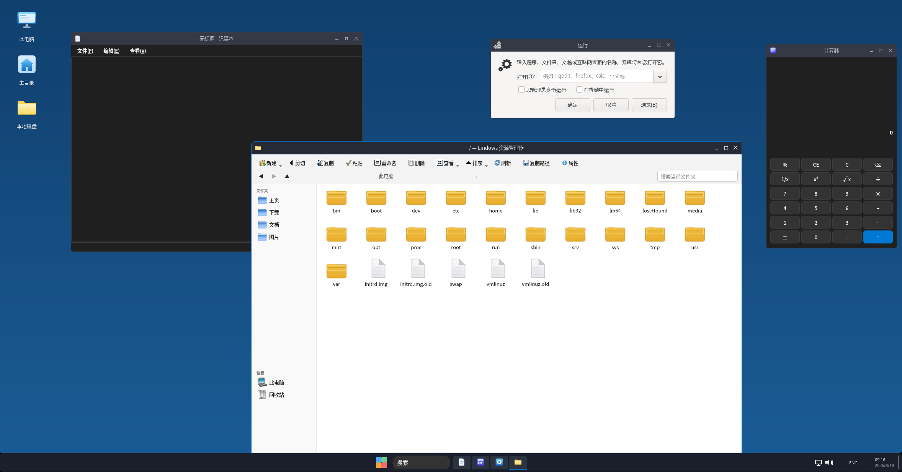

# ElevenDE 3.5.1

**ElevenDE** 是面向 Debian 系发行版的 X11 桌面环境。项目以 C/Xlib Shell、Openbox、picom、Qt 6 与 GTK 3 为基础，提供接近 Windows 11 的浅色视觉层次、桌面、任务栏、开始菜单、登录页、设置与 Lindows 资源管理器，同时保持 Linux 应用和 X11 窗口管理器生态的兼容性。



> **发布原则。** 源码、构建脚本、配置和可再生成资源保存在 Git 仓库；`*.deb` 不提交到仓库，而是仅作为 GitHub Release 的附件发布。这样发布包始终能够对应一个可审计的源代码提交。

## 3.5.1 发布重点

3.5.1 集中完善 Lindows 桌面的可用性与 Windows 11 风格的一致性。任务栏会根据 X11 `WM_CLASS` 优先解析受控图标资源，终端 `xterm`、设置、计算器、记事本、任务管理器和资源管理器都拥有稳定的第一方图标映射。开始菜单会监测用户、系统与 Flatpak 应用目录，安装、删除或更新 `.desktop` 启动器后可在运行中自动刷新；启动条目时优先通过 `gtk-launch`/GIO 按标准 desktop ID 解析，避免将应用的启动器或 Desktop Action 错交给资源管理器。桌面 Shell 在壁纸切换时同时使用原子文件替换、根窗口版本属性和客户端消息通知，以减少单次 X11 通知遗漏造成的延迟刷新。

本版本同时完成四项体验升级：**内置照片程序移除**，开始菜单保留“照片”入口并改为启动系统默认图片查看器（`xdg-mime` 解析 + `gtk-launch`，回退到 eog/Loupe/xviewer 等常见查看器，`image/*` 关联不再指向已删除的启动器）；**文件拖放**，资源管理器的图标/列表/详情三个视图都可将文件拖出（Qt XDND 源），桌面 Shell 实现 XDND v5 目标，把拖到桌面的文件复制进 `~/Desktop` 并立即显示为图标（复制在子进程执行，拖入大目录不会卡住 Shell），同样的拖放也可投递给其他支持 XDND 的程序；**会话稳定性**，`elevende-session` 增加监督循环，picom、Shell、通知守护和 SAS 守护崩溃后可有限次自动重启，并补上 TERM/HUP 清理会话进程的 trap；**动画打磨**，开始菜单关闭时增加与打开对称的下滑动画，资源管理器目录树启用展开动画，picom ≥ 12 的系统会自动附加窗口打开/关闭动画预设（旧版本如 Ubuntu 24.04 的 picom 10.x 不认识该配置，会话脚本按版本跳过并在启动失败时自动回退到稳定配置）。终端 `xterm` 本身不支持 XDND，无法接收拖放——这是上游程序限制，拖放目标为桌面和其他 XDND 程序。

| 区域 | 3.5.1 行为 |
|---|---|
| 桌面与任务栏 | 支持动态任务按钮布局、窗口销毁后的即时按钮清理、网络/音量/电池状态图标、输入法标识、显示桌面与 Win11 风格开始菜单；开始菜单可发现新安装的 XDG/Flatpak 应用并按 desktop ID 启动。 |
| 登录与锁屏 | 使用系统账户显示名、官方 Fluent 默认用户头像、密码框、焦点状态与无密码账户兼容的认证路径。 |
| 设置 | 固定浅色界面；支持壁纸立即应用、显示重排、紧凑声音页和 GPL/版本信息。 |
| Lindows 资源管理器 | 使用侧栏、命令栏、路径栏、彩色位置图标、This PC 磁盘卡片、文件操作与双击进入磁盘等交互。 |
| 资源 | 采用项目自有生成资产、Microsoft Fluent System Icons 与按来源保留说明的 WindowsIcons 转换资源。 |
| 照片 | 内置 `elevende-photos` 程序移除；开始菜单保留“照片”入口，通过 `xdg-mime` + `gtk-launch` 启动系统默认图片查看器。 |
| 文件拖放 | 资源管理器三个视图可拖出文件；桌面为 XDND v5 目标，拖入的文件复制到 `~/Desktop` 并生成图标。 |
| 会话稳定性 | 会话监督循环自动重启崩溃的 compositor/Shell/通知/SAS 守护（每会话限 3 次），TERM/HUP 时清理全部会话进程。 |
| 动画 | 开始菜单关闭下滑动画、资源管理器目录树展开动画；picom ≥ 12 自动启用窗口打开/关闭动画预设，旧版本自动回退。 |

当前版本已经在隔离 Xvfb 与 Openbox 会话中回归验证：开始菜单、登录页、连续壁纸切换、终端任务栏图标、任务栏多窗口清理、设置和资源管理器关键交互均通过实际截图或窗口属性检查。开始菜单回归额外验证了在菜单保持打开时新增 `.desktop` 条目会显示为新结果，并确认 Desktop Action 中故意错误的 `explorer.exe` 命令不会取代主应用启动命令。

## 快速构建与安装

推荐使用 Debian、Ubuntu、Kali、Mint 或其他 apt 系发行版。构建脚本会构建 Shell、Qt/GTK 应用、Lindows 资源管理器、SAS、RunBox 和包资源；若本地已有上游图标源，可传入其路径以离线刷新转换资源。

持续集成（`.github/workflows/build-deb.yml`）会在 push、`v*` 标签、PR 和手动触发时自动执行 `build-deb.sh`，校验包内容、依赖解析，并在 Xvfb 下冒烟运行 Shell——日常开发无需本地构建。

```sh
sudo apt update
sudo apt install -y build-essential cmake pkg-config git \
  libx11-dev libxft-dev libxtst-dev libxi-dev libpng-dev \
  libgdk-pixbuf-2.0-dev librsvg2-bin \
  qt6-base-dev qt6-base-dev-tools libgtk-3-dev \
  openbox picom xterm

# 可选：指定本地的图标源目录；没有也可使用已提交的转换资源构建。
WINDOWSICONS_SOURCE=/path/to/WindowsIcons/Icons \
FLUENT_SOURCE=/path/to/fluentui-system-icons/assets \
./build-deb.sh

sudo apt install ./elevende_3.5.1_amd64.deb
```

安装后可从显示管理器选择 ElevenDE 会话，或按照项目安装提示配置自动登录。源码安装适用于开发环境：

```sh
sudo ./install.sh
```

## 目录与维护边界

下表是本仓库的维护边界。**“ElevenDE 自主代码”** 指由 SYSTEM-Intel-MIC 为 ElevenDE 编写的代码、配置、构建逻辑、集成逻辑和对上游的增量修改；该部分以 GPL-3.0-or-later 发布。原始上游文件仍保留其原始版权与许可证，不因放入本仓库而被追溯改写。

| 路径 | 内容 | 维护与许可证边界 |
|---|---|---|
| `shell/`、`apps/`、`wm/`、`session/`、`scripts/`、`tools/` | ElevenDE Shell、内置应用、会话、窗口主题、构建辅助与集成代码 | SYSTEM-Intel-MIC 的自主代码，GPL-3.0-or-later。 |
| `assets/` | 启动器、壁纸、图标转换脚本、转换结果、Mica 材料和来源说明 | ElevenDE 自主脚本和配置为 GPL；第三方图标分别遵循其来源条款。 |
| `Explorer-for-Linux/` | Lindows 资源管理器的上游基础及本地增强 | 原始基础为 MIT；本项目的增量修改为 GPL-3.0-or-later，原 MIT 声明必须保留。 |
| `SAS-for-Linux/` | Ctrl+Alt+Delete 安全选项屏幕上游基础 | 原始基础为 MIT；ElevenDE 的构建、会话和调用整合为 GPL-3.0-or-later。 |
| `runbox-linux/` | Win+R 对话框及其 ElevenDE 集成 | 由 SYSTEM-Intel-MIC 维护的组件；随本发布由权利人以 GPL-3.0-or-later 提供。 |
| `LICENSES/` | 上游 MIT 许可证副本 | 仅用于保留上游许可与版权通知，不改变原始文件的作者归属。 |

### Lindows 资源管理器与 Explorer-for-Linux 的关系

Lindows 资源管理器以 [macOS-Terminal/Explorer-for-Linux][explorer-upstream] 的 MIT 代码为基础；ElevenDE 并不将原始上游全部表述为自研代码。3.5.1 的本地重构主要位于 `src/explorer/filelist.cpp`、`main.cpp`、`mainwindow.cpp`、`style.cpp` 和 `thispc.cpp`，覆盖命令栏与路径栏布局、Windows 风格侧栏、图标解析、This PC 驱动器卡片以及单击选择/双击进入等交互。

> 这些修改的新增表达由 SYSTEM-Intel-MIC 以 GPL-3.0-or-later 发布；上游 MIT 版权与许可证同时适用于其原始部分。任何再发布者都必须同时保留 `LICENSES/Explorer-for-Linux-MIT.txt`、本仓库 `LICENSE` 和 [`THIRD-PARTY-NOTICES.md`](THIRD-PARTY-NOTICES.md) 中的声明。

## 图标与品牌资源

Microsoft Fluent System Icons 为 MIT 许可，项目保留其许可证副本并通过 `assets/import_fluent_icons.py` 导入需要的 SVG/PNG 图标。[1] [2] 部分 Windows 风格 PNG 由 WindowsIcons ICO 资源转换而来；来源、转换方式和商标边界见 [`assets/WINDOWSICONS-NOTICE.md`](assets/WINDOWSICONS-NOTICE.md)。Windows、Windows 11 和相关商标归其各自权利人所有；ElevenDE 不主张这些商标的所有权。[3]

## 发布与贡献

每一个发布都应遵循相同流程：先在干净工作树中构建 `elevende_3.5.1_amd64.deb`，再提交源代码和文档，最后将生成的 DEB 附加到同一版本的 GitHub Release。请不要提交本地二进制、`build/`、临时截图、回归日志或 `*.deb`；这些内容已由 `.gitignore` 排除。

对 Shell、设置、资源管理器或资源文件的改动应保留可构建源码，并在提交前至少执行：

```sh
git diff --check
./build-deb.sh
dpkg-deb -I elevende_3.5.1_amd64.deb
git status --short
```

## 许可证

根目录 [`LICENSE`](LICENSE) 是未经改写的 GNU General Public License version 3。SYSTEM-Intel-MIC 对 ElevenDE 自主代码及其可授权的新增修改采用 **GPL-3.0-or-later**。MIT 上游代码、Microsoft Fluent 图标和其他第三方资产并不因根目录 GPL 而自动被改写；准确的文件级边界、许可证副本和再发布义务见 [`THIRD-PARTY-NOTICES.md`](THIRD-PARTY-NOTICES.md)。

## 参考资料

[1]: https://github.com/microsoft/fluentui-system-icons "Microsoft Fluent System Icons"
[2]: https://github.com/microsoft/fluentui-system-icons/blob/main/LICENSE "Fluent System Icons MIT License"
[3]: https://github.com/HaydenReeve/WindowsIcons "HaydenReeve WindowsIcons"
[explorer-upstream]: https://github.com/macOS-Terminal/Explorer-for-Linux "Explorer-for-Linux"
