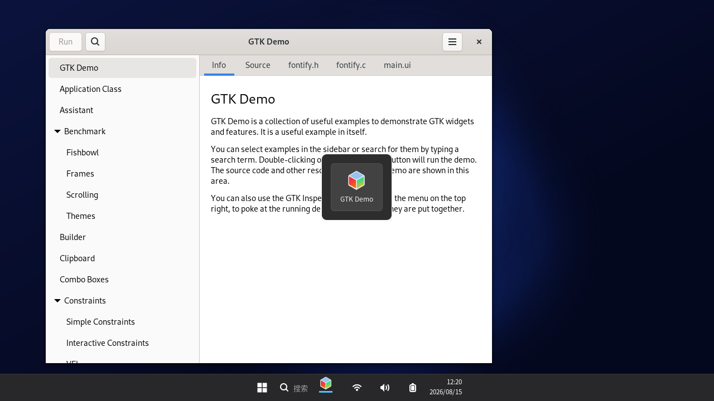

# ElevenDE

**Windows 11 风格的 Linux Wayland 桌面环境** —— 自研 wlroots 合成器 + GTK4 Shell，目标是在视觉与交互上对齐 Windows 11，同时完整保留 Linux 生态兼容性（原生 Wayland 应用 + XWayland X11 应用）。


| | |
|---|---|
|  |  |
| *开始菜单（左对齐任务栏图标组，Windows 11 行为）* | *Alt-Tab 窗口切换器* |

> **状态：M1 里程碑**。核心桌面已可用（窗口管理、任务栏、开始菜单、Alt-Tab、X11 兼容）。完整替代 KDE/GNOME 是长期工程，见[路线图](#路线图)。

---

## 特性

- 🪟 **自研 Wayland 合成器**（C，wlroots 0.17）：xdg-shell / layer-shell / XWayland / 剪贴板 / 截图 / 分数缩放等标准协议
- 🎨 **Windows 11 视觉**：Bloom 风格壁纸、居中任务栏、圆角半透明深色主题、开始菜单左对齐任务栏图标组、托盘区（网络/音量/电池 pill + 时钟 + 显示桌面）严格右对齐
- ⌨️ **Windows 式交互**：`Super` 打开开始菜单、`Alt+Tab` 窗口切换器（MRU 顺序）、`Alt+F4` 关闭、拖动/缩放/最小化/最大化/全屏
- 📦 **兼容性优先**：GTK / Qt / Electron / Flatpak 原生 Wayland 应用 + XWayland 承载全部 X11 遗留应用
- 🔌 **Shell-合成器解耦**：JSON-over-Unix-socket IPC，Shell 可独立重写（Python → C/Rust）而不改合成器
- 💿 **跨发行版一键安装**：Debian/Ubuntu、Fedora/RHEL、Arch、openSUSE、Alpine 自动识别，wlroots 版本不符时自动源码编译 0.17.1 兜底

## 架构

```
┌───────────────────────────────────────────────────────┐
│  elevende 合成器 (C, wlroots 0.17)                     │
│                                                       │
│  后端: DRM/KMS(真机) · X11(嵌套) · headless(测试)      │
│  渲染: GLES2 / Pixman(软渲染) 场景图 scene-graph       │
│                                                       │
│  场景树堆叠顺序（自底向上）:                            │
│    tree_bg → tree_bottom → tree_toplevels(应用窗口)    │
│           → tree_top(任务栏) → tree_overlay(菜单/OSD)  │
│                                                       │
│  协议: xdg-shell · wlr-layer-shell · XWayland ·        │
│        xdg-decoration(CSD优先) · xdg-activation ·      │
│        fractional-scale · viewporter · screencopy ·    │
│        data-control · primary-selection · xdg-output   │
└──────────────┬────────────────────────────────────────┘
               │ $XDG_RUNTIME_DIR/elevende-ipc.sock
               │ （JSON 行协议，双向，见下文规格）
┌──────────────┴────────────────────────────────────────┐
│  Win11 Shell (Python + GTK4 + gtk4-layer-shell)        │
│                                                       │
│  WallpaperWindow  BACKGROUND层 · Cairo 绘制 Bloom 渐变 │
│  TaskbarWindow    TOP层 · exclusive zone 48px          │
│  StartMenuWindow  OVERLAY层 · 独占键盘 · Esc/Super 关闭│
│  AltTabWindow     OVERLAY层 · 纯展示，不抢焦点          │
│  style.css        Win11 深色主题                       │
└───────────────────────────────────────────────────────┘
```

## 技术实现

### 合成器（`compositor/elevende.c`）

**视图抽象**：`struct view` 统一 xdg-shell toplevel 与 XWayland surface，共享焦点、移动、缩放、最小化、最大化、全屏逻辑。XWayland 采用 wlroots 0.17 的 associate/dissociate 生命周期（map/unmap 监听在 associate 时挂载）。

**窗口管理**：
- 焦点：`focus_view()` 维护 MRU 链表（`server->views` 头 = 最近使用），同时处理 xdg `set_activated` 与 XWayland `activate`
- 交互移动/缩放：`Alt+拖拽` 或 CSD 标题栏请求（`request_move`/`request_resize`），缩放支持四角与四边
- 最大化：恢复目标输出（光标所在屏）的 work area（扣除任务栏独占区）
- 全屏：占满整个输出并提升到 toplevel 树顶
- 最小化：隐藏场景节点，X11 侧同步 `set_minimized`
- 新窗口级联摆放（cascade），避免完全重叠

**Layer-shell 布局算法**（`arrange_output_layers`）：
1. Pass 1：所有已映射且 `exclusive_zone > 0` 的表面向 work area 让渡区域（任务栏）
2. Pass 2：配置所有 initialized 表面 —— `exclusive_zone ∈ {-1, >0}` 用全屏 bounds（壁纸为 -1 覆盖整个输出），其余用 work area；按 anchor/margin 计算尺寸与位置
3. **定位使用实际 buffer 尺寸**（`surface->current.width/height`），兼容渲染尺寸小于配置尺寸的客户端（GTK 固定高度窗口）
4. `exclusive_zone == -1`（壁纸）忽略其他独占区

> ⚠️ 关键时序：wlroots 在**首次 commit 处理过程中**发出 `new_surface` 信号，compositor 必须在 `new_surface` 回调里立即 arrange/configure，否则客户端拿不到初始 configure、永远不会 attach buffer（死锁）。

**键盘**：
- `Super` 单独按下并释放（未组合其他键）→ 向 Shell 发送 `super` 事件（开关开始菜单）；合成器吞掉 Super 键本身
- `Alt` 按下/释放 → `alt_tab` 事件（开/关切换器浮层），`Alt+Tab` 在 MRU 链表中循环焦点，`Alt+F4` 关闭当前窗口，`Alt+Esc` 退出合成器（调试用）
- XKB 键盘映射遵循 `XKB_DEFAULT_*` 环境变量

**IPC**：Unix socket，`$XDG_RUNTIME_DIR/elevende-ipc.sock`，JSON 行协议（规格见下）。基于 `wl_event_loop_add_fd` 集成进 Wayland 事件循环，支持多客户端，`hello` 时全量同步窗口列表。

### IPC 协议规格

**Shell → 合成器（命令）**

| 消息 | 说明 |
|---|---|
| `{"cmd":"hello"}` | 请求全量状态（合成器回复 `hello` 事件） |
| `{"cmd":"focus","id":N}` | 聚焦窗口 |
| `{"cmd":"minimize","id":N}` | 最小化 |
| `{"cmd":"restore","id":N}` | 恢复并聚焦 |
| `{"cmd":"maximize","id":N}` | 最大化/还原切换 |
| `{"cmd":"fullscreen","id":N}` | 全屏切换 |
| `{"cmd":"close","id":N}` | 关闭 |
| `{"cmd":"quit"}` | 退出合成器 |

**合成器 → Shell（事件）**

| 消息 | 说明 |
|---|---|
| `{"event":"hello","focused":N,"windows":[{"id","title","app_id","minimized","maximized","fullscreen"}…]}` | 全量状态（连接时自动发送） |
| `{"event":"ready"}` | 合成器就绪 |
| `{"event":"window_added","id","title","app_id"}` | 新窗口 |
| `{"event":"window_title","id","title"}` | 标题变更 |
| `{"event":"window_removed","id"}` | 窗口关闭 |
| `{"event":"window_focused","id"}` | 焦点变更（0 = 无焦点） |
| `{"event":"window_state","id","minimized","maximized","fullscreen"}` | 状态变更 |
| `{"event":"super"}` | Super 键单独按下释放 |
| `{"event":"alt_tab","active":true|false}` | Alt 按下/释放 |

### Shell（`shell/shell.py` + `style.css`）

单进程承载四个 layer-shell 窗口（GTK4 多窗口 + gtk4-layer-shell）：

- **壁纸**：`Gtk.DrawingArea` + Cairo 多层径向渐变近似 Win11 Bloom；`exclusive_zone = -1` 覆盖整个输出
- **任务栏**：48px 高，`LEFT+RIGHT+BOTTOM` 锚定 + 独占区；`Gtk.Overlay` 双层布局——图标组用左右等分弹性容器真正屏幕居中，托盘区作为 overlay 子件 `halign=END` 钉死右边缘（GtkBox 对非扩展子件不应用 halign，必须用 Overlay 才能实现 Win11 几何）；托盘按 Win11 结构：网络+音量+电池合并为一个 pill 按钮、时钟/日期按钮、最右 8px「显示桌面」细条（点击最小化全部，再点恢复）；运行中窗口显示图标按钮 + 底部指示条（聚焦时加宽变亮）
- **开始菜单**：`OVERLAY` 层、`BOTTOM+LEFT` 锚定；**打开时实时计算任务栏图标组的 x 坐标**（`Gtk.Widget.get_allocation()`），菜单左边缘对齐图标组左边缘 —— 与 Windows 11 一致；独占键盘模式，`Esc`/`Super`/点击其他窗口关闭；内容为搜索框 + `.desktop` 应用网格（`Gio.AppInfo` 扫描，按名称排序，实时过滤，图标走 GTK IconTheme 解析）
- **Alt-Tab 切换器**：`OVERLAY` 层居中浮层，`KeyboardMode.NONE` 不抢焦点；按 MRU 顺序展示窗口图标+标题，高亮当前选中；由 `alt_tab` / `window_focused` 事件驱动

**主题**：全部 CSS 实现（深色 #1c1c1e 任务栏、圆角 10px、半透明、Win11 强调色 `#4cc2ff`）。layer-shell 窗口的样式通过**填满窗口的根容器 CSS class** 实现（layer-shell 窗口的 window 节点背景不可靠，详见 [KNOWN-ISSUES 注释]）。

**gtk4-layer-shell 加载**：Python 必须在 `import gi` **之前** `ctypes.CDLL("libgtk4-layer-shell.so.0")`（符号拦截顺序要求），LD_PRELOAD 在 GI 环境下不可靠。

### 兼容性策略

| 应用类型 | 通路 | 状态 |
|---|---|---|
| GTK4 / libadwaita | Wayland 原生（CSD） | ✅ 已验证 |
| Qt / Electron / Flatpak | xdg-shell + fractional-scale + viewporter | ✅ 协议已启用 |
| X11 遗留应用 | XWayland（lazy 可选，默认立即启动） | ✅ 已验证（xterm） |
| 剪贴板管理器 | wlr-data-control（wl-clipboard 可用） | ✅ |
| 截图/录屏 | wlr-screencopy / export-dmabuf（grim 可用） | ✅ |
| Windows `.exe` | 规划通过 Wine/Proton 桌面入口集成（M3） | ⏳ |

## 安装（推荐：一键脚本）

```sh
sudo ./install.sh
```

自动识别发行版家族并安装依赖：

| 家族 | 包管理器 | 代表发行版 |
|---|---|---|
| debian | apt | Debian、Ubuntu、Linux Mint、Pop!_OS |
| fedora | dnf | Fedora、RHEL、CentOS、Rocky |
| arch | pacman | Arch、Manjaro、EndeavourOS |
| suse | zypper | openSUSE Leap/Tumbleweed |
| alpine | apk | Alpine（postmarketOS 同源） |

两个关键依赖的兜底策略：

- **wlroots 必须是 0.17.x**（0.18+ API 不兼容）。脚本先用发行版包，版本不符（典型如 Arch/Tumbleweed 等滚动发行版）自动 clone `0.17.1` tag 源码编译到 `/usr/local`
- **gtk4-layer-shell** 多数发行版未打包：Fedora 直接用仓库包，其余自动源码构建

> Debian 路径已在 Ubuntu 24.04 完整验证；其余家族的包名映射为 best-effort，欢迎 PR 修正。

## 手动构建

### 依赖（Ubuntu 24.04 / Debian trixie）

```
meson ninja-build pkg-config gcc libwlroots-dev(≥0.17,<0.18) libwayland-dev
wayland-protocols libxkbcommon-dev libinput-dev libdrm-dev libgbm-dev
libseat-dev libpixman-1-dev libudev-dev libegl-dev libgles-dev xwayland
libgtk-4-dev python3-gi gir1.2-gtk-4.0 libgirepository1.0-dev
gobject-introspection desktop-file-utils grim xterm gtk-4-examples
adwaita-icon-theme fonts-noto-cjk
```

> `libwlroots-dev` 必须是 **0.17.x**。wlroots 0.18+ API 有破坏性变更（layer-shell 能力参数、xwayland 生命周期等），尚未适配。

### 构建 gtk4-layer-shell（Ubuntu 未打包）

```sh
git clone --depth 1 https://github.com/wmww/gtk4-layer-shell.git
cd gtk4-layer-shell
meson setup build --prefix=/usr -Dexamples=false -Ddocs=false -Dvapi=false
ninja -C build && sudo ninja -C build install && sudo ldconfig
```

### 编译合成器

```sh
meson setup build compositor
ninja -C build
```

GitHub Actions 自动构建见 `.github/workflows/build.yml`（ubuntu-24.04：装依赖 → 源码构建 gtk4-layer-shell → 编译 → headless 冒烟测试 → 打包产物）。

## 运行

**真机**：

```sh
sudo ./install.sh
# 注销 → 登录界面选择 “ElevenDE” → 登录
```

**无头/嵌套测试**（无 GPU 环境，本仓库 CI 同款）：

```sh
export XDG_RUNTIME_DIR=/tmp/ed WLR_BACKENDS=headless WLR_RENDERER=pixman
mkdir -p $XDG_RUNTIME_DIR
./build/elevende -s "python3 shell/shell.py"
# 另一个终端：
WAYLAND_DISPLAY=wayland-0 grim shot.png          # 截图
# 调试开关：
ED_AUTOMENU=1   # 启动 8s 后自动打开开始菜单（演示/截图用）
ED_AUTOALTTAB=1 # 启动 9s 后自动显示 Alt-Tab 浮层
```

**X11 嵌套窗口模式**（在现有 X 桌面里开一个窗口跑）：`WLR_BACKENDS=X11`（需要 EGL 支持，软件渲染环境用 headless）。

## 快捷键

| 按键 | 行为 |
|---|---|
| `Super`（单按） | 打开/关闭开始菜单 |
| `Alt+Tab` | 窗口切换器（MRU 循环） |
| `Alt+F4` | 关闭当前窗口 |
| `Alt+拖拽` | 移动窗口 |
| `Alt+右拖拽` | 缩放窗口（沿用 tinywl 约定，后续改为 Win11 边缘吸附） |
| `Alt+Esc` | 退出合成器（调试） |

## 目录结构

```
elevende/
├── compositor/
│   ├── elevende.c                        # 合成器（约 1600 行 C）
│   ├── meson.build
│   └── protocols/wlr-layer-shell-unstable-v1.xml
├── shell/
│   ├── shell.py                          # 壁纸+任务栏+开始菜单+Alt-Tab
│   └── style.css                         # Win11 深色主题
├── session/
│   ├── elevende.desktop                  # wayland-sessions 入口
│   └── elevende-session                  # 会话脚本
├── assets/                               # 演示 .desktop（xterm/gtk4-demo）
├── docs/                                 # 截图
├── .github/workflows/build.yml           # CI：编译+冒烟测试+打包
├── install.sh
├── LICENSE                               # MIT
└── README.md
```

## 路线图

- **M0 ✅** 合成器启动 / xdg-shell / layer-shell / XWayland / IPC / 任务栏 / 开始菜单 / 壁纸
- **M1 ✅** 开始菜单 Win11 式对齐 / Alt-Tab 切换器 UI / margin 布局修正 / CI
- **M1.1 ✅(本轮)** 任务栏托盘区 Win11 式右对齐（Overlay 布局 + pill 托盘 + 显示桌面）/ 跨发行版安装脚本（5 大家族 + wlroots 源码兜底）
- **M2 ⏳** SSD 圆角标题栏（Qt/X11 窗口）、窗口动画、Snap 布局（Win+方向键）、快速设置面板、真实托盘（StatusNotifier）、电源菜单（logind）
- **M3 ⏳** 文件管理器、设置中心、锁屏（session-lock 协议）、通知中心、多显示器完整布局
- **M4 ⏳** deb/PPA 打包、发行版适配、Wine/Proton 集成、性能与功耗优化、可访问性

## 已知限制（M1）

- 窗口无圆角（wlroots 圆角需自定义 shader，M2 实现）
- 托盘 pill 按钮为静态占位（未接 StatusNotifier/DBus/快速设置）；时钟无日历弹窗
- 时钟/日期无日历弹窗；快速设置未接真实后端（NetworkManager/UPower）
- 无 GPU 容器内使用 pixman 软渲染，真机 DRM 路径待社区验证

## 贡献

欢迎 PR。开发环境搭建：按上文「构建」走一遍，用 headless 模式 + `grim` 截图做回归验证。改动合成器请保持 `WLR_LOG_LEVEL=debug` 下无新增 warning；改动 Shell 请 `python3 -m py_compile shell/shell.py` 后跑 `ED_AUTOMENU=1` 截图自检。

## 许可

[MIT](LICENSE)

---

内容由 AI 生成
